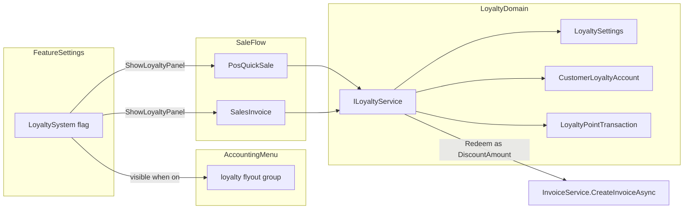

# خطة نظام الولاء (Loyalty) — المحاسب

**الحالة:** معتمدة للنطاق  
**النطاق:** MVP كامل  
**النموذج المالي:** استبدال النقاط كخصم فاتورة + سجل حركة نقاط مرتبط بالزبون والفاتورة  
**النظام المستهدف:** نظام المحاسبة فقط (`AccountingSystemModule`)  
**التقنية:** WPF + CommunityToolkit.Mvvm + EF Core (نفس طبقات المشروع الحالية)

---

## 1. الهدف

إضافة ميزة **نظام الولاء** قابلة للتفعيل/الإلغاء من **إعدادات الميزات**. عند التفعيل تظهر كل شاشات وتقارير الولاء داخل **كروب منيو واحد**، ويُدمج كسب/استبدال النقاط في **فاتورة المبيعات** و**بيع سريع (POS)** بواجهة حديثة ومتحركة، مع الحفاظ على هيكلية المشروع وأنماط الميزات الحالية.

عند الإلغاء: تُخفى المجموعة بالكامل، وتُخفى عناصر الولاء من الفاتورة/الكاشير، ولا تُنفَّذ عمليات كسب أو استبدال جديدة.

---

## 2. القرارات الثابتة (لا تُعاد مناقشتها أثناء التنفيذ)

| قرار | القيمة |
|------|--------|
| نطاق الإصدار | MVP كامل |
| كسب النقاط | تلقائي بعد حفظ فاتورة بيع (Sale) ناجحة لزبون محدد |
| استبدال النقاط | يُحوَّل إلى `Invoice.DiscountAmount` (خصم رأس الفاتورة) |
| التزام محاسبي منفصل | غير مطلوب في هذه المرحلة |
| دليل حسابات | غير مستخدم (النظام بلا COA تقليدي) |
| التفعيل الافتراضي | معطّل (`false`) مثل بقية الميزات |
| التخزين | قواعد الولاء + الأرصدة + الحركات في قاعدة المحاسبة المحلية |
| المزامنة السحابية / الموبايل | خارج نطاق MVP (يُوثَّق كمرحلة لاحقة) |
| فواتير الشراء / المرتجعات / الأقساط | خارج كسب الولاء في MVP (بيع فقط) |

---

## 3. المبادئ المعمارية

1. **اتباع نمط الميزات الحالي** (`BusinessFeatureFlags` + `FeatureToggleCard` + `IsFeatureFlagVisible` + `Show*` في `*.Features.cs`).
2. **عدم إنشاء Application System جديد** — الولاء ميزة داخل المحاسبة وليست نظاماً مستقلاً مثل الذهب/الفندق.
3. **فصل الطبقات:** Entities/Enums في Core → Services في Infrastructure → ViewModels/Views/Controls في UI.
4. **الاستبدال = خصم:** لا مسار دفع جديد؛ يُحدَّث `DiscountAmount` قبل/أثناء `IInvoiceService.CreateInvoiceAsync`.
5. **الرصيد مشتق + مخزَّن:** `CustomerLoyaltyAccount.PointsBalance` يُحدَّث داخل نفس معاملة قاعدة البيانات مع إدراج `LoyaltyPointTransaction`.
6. **الواجهة:** RTL، `PageStyle`، `Theme.xaml`، `PageEntranceAnimator`، بدون بطاقات زائدة في أماكن لا تحتاج تفاعلاً.



---

## 4. نموذج البيانات

### 4.1 الكيانات الجديدة (`AlMuhasib.Core/Entities`)

#### `LoyaltySettings` (سجل إعدادات واحد لكل قاعدة بيانات)

| الحقل | النوع | الوصف |
|-------|------|--------|
| `IsEnabledMirror` | `bool` | اختياري للمزامنة المحلية مع العلم؛ المصدر التشغيلي للواجهة هو Feature Flag |
| `PointsPerAmount` | `decimal` | مبلغ الفاتورة الصافي المطلوب لنقطة واحدة (مثال: 1000 د.ع = 1 نقطة) |
| `PointValueInCurrency` | `decimal` | قيمة النقطة عند الاستبدال بالدينار |
| `MinInvoiceAmountToEarn` | `decimal` | حد أدنى لصافي الفاتورة لكسب النقاط |
| `MinPointsToRedeem` | `int` | أقل نقاط مسموح استبدالها |
| `MaxRedeemPercentOfInvoice` | `decimal` | سقف نسبة الاستبدال من صافي الفاتورة قبل خصم الولاء (0–100) |
| `PointsExpireAfterDays` | `int?` | null = بلا انتهاء |
| `EarnOnCreditSales` | `bool` | هل تُكسب نقاط من البيع الآجل |
| `RoundEarnDown` | `bool` | تقريب الكسب للأسفل (افتراضي true) |

#### `CustomerLoyaltyAccount`

| الحقل | النوع | الوصف |
|-------|------|--------|
| `CustomerId` | `int` (FK, unique) | الزبون |
| `PointsBalance` | `int` | الرصيد الحالي |
| `LifetimeEarned` | `int` | إجمالي مكتسب |
| `LifetimeRedeemed` | `int` | إجمالي مستبدل |
| `Tier` | `LoyaltyTier` | عادي / فضي / ذهبي (محسوب أو يدوي مبسّط في MVP) |
| `LastEarnedAt` / `LastRedeemedAt` | `DateTime?` | للتقرير والواجهة |

#### `LoyaltyPointTransaction`

| الحقل | النوع | الوصف |
|-------|------|--------|
| `CustomerId` | `int` | الزبون |
| `InvoiceId` | `int?` | الفاتورة المرتبطة |
| `Type` | `LoyaltyTransactionType` | Earn / Redeem / Adjust / Expire |
| `Points` | `int` | موجبة للكسب، موجبة للاستبدال مع `Type=Redeem` (يُنقص الرصيد في الخدمة) |
| `UnitValue` | `decimal` | قيمة النقطة وقت الحركة |
| `CurrencyAmount` | `decimal` | أثر مالي = نقاط × قيمة (للاستبدال يساوي مبلغ الخصم) |
| `BalanceAfter` | `int` | الرصيد بعد الحركة |
| `Note` | `string?` | سبب التعديل اليدوي |
| `CreatedByUserId` | `int?` | المستخدم |

### 4.2 تعديلات كيانات قائمة

**`Invoice`** — حقول اختيارية للتتبع دون كسر التقارير الحالية:

- `LoyaltyPointsEarned` (`int`)
- `LoyaltyPointsRedeemed` (`int`)
- `LoyaltyRedeemDiscountAmount` (`decimal`) — الجزء من `DiscountAmount` الناتج عن الولاء

**`Customer`** — لا يُضاف رصيد نقاط مباشرة على الجدول؛ العلاقة عبر `CustomerLoyaltyAccount` للحفاظ على نظافة كيان الزبون.

### 4.3 التعدادات (`AlMuhasib.Core/Enums`)

```csharp
public enum LoyaltyTransactionType { Earn = 1, Redeem = 2, Adjust = 3, Expire = 4 }
public enum LoyaltyTier { Standard = 0, Silver = 1, Gold = 2 }
```

### 4.4 EF / Migrations

- Configurations تحت `Infrastructure/Data/Configurations/`
- `DbSet<>` في `AppDbContext`
- Migration جديدة تحت `Infrastructure/Data/Migrations/` بنفس أسلوب `AddProductAndInvoiceItemDiscount`
- Indexes: `CustomerLoyaltyAccount.CustomerId` Unique، `LoyaltyPointTransaction(CustomerId, CreatedAt)`، `InvoiceId`

---

## 5. طبقة الخدمات

### 5.1 العقود (`AlMuhasib.Core/Interfaces/Services`)

```csharp
public interface ILoyaltyService
{
    Task<LoyaltySettings> GetSettingsAsync(CancellationToken ct = default);
    Task SaveSettingsAsync(LoyaltySettings settings, CancellationToken ct = default);

    Task<CustomerLoyaltyAccount?> GetAccountAsync(int customerId, CancellationToken ct = default);
    Task<int> GetBalanceAsync(int customerId, CancellationToken ct = default);

    int CalculateEarnPoints(decimal invoiceNetBeforeLoyaltyDiscount, LoyaltySettings settings);
    decimal CalculateRedeemDiscount(int points, LoyaltySettings settings);

    Task<LoyaltyQuote> QuoteAsync(int customerId, decimal invoiceSubtotal, int? redeemPoints, CancellationToken ct = default);

    /// <summary>يُستدعى داخل نفس وحدة العمل/المعاملة بعد إنشاء الفاتورة.</summary>
    Task ApplyInvoiceLoyaltyAsync(Invoice invoice, int? redeemPoints, CancellationToken ct = default);

    Task AdjustPointsAsync(int customerId, int pointsDelta, string note, int? userId, CancellationToken ct = default);
    Task<IReadOnlyList<LoyaltyPointTransaction>> GetLedgerAsync(int customerId, DateTime? from, DateTime? to, CancellationToken ct = default);
}
```

### 5.2 قواعد العمل (MVP)

**كسب**

1. الميزة مفعّلة + يوجد `CustomerId` + نوع الفاتورة `Sale`.
2. إذا كان الدفع آجلاً و`EarnOnCreditSales=false` → لا كسب.
3. صافي أساس الكسب = إجمالي البنود − الخصومات الأخرى (بدون خصم الولاء) مع احترام `MinInvoiceAmountToEarn`.
4. `earned = Floor(base / PointsPerAmount)` عند `RoundEarnDown`.
5. إدراج حركة `Earn` + تحديث الرصيد.

**استبدال**

1. الزبون محدد والرصيد كافٍ و`points >= MinPointsToRedeem`.
2. `discount = points * PointValueInCurrency`.
3. لا يتجاوز `MaxRedeemPercentOfInvoice` من أساس الفاتورة.
4. يُضاف المبلغ إلى `Invoice.DiscountAmount` ويُخزَّن أيضاً في `LoyaltyRedeemDiscountAmount`.
5. إدراج حركة `Redeem` + إنقاص الرصيد **قبل** أو **ضمن** معاملة حفظ الفاتورة (فشل الحفظ = Rollback كامل).

**التعديل اليدوي**

- من شاشة حساب ولاء الزبون بصلاحية خاصة، مع ملاحظة إلزامية وحركة `Adjust`.

### 5.3 نقاط الربط مع الفوترة

| الملف | التعديل |
|-------|---------|
| [`InvoiceService.cs`](../src/AlMuhasib.Infrastructure/Services/InvoiceService.cs) | بعد إنشاء الفاتورة وقبل Commit: استدعاء `ApplyInvoiceLoyaltyAsync` إن وُجدت نقاط/كسب |
| [`SalesInvoiceViewModel.cs`](../src/AlMuhasib.UI/ViewModels/SalesInvoiceViewModel.cs) | تجميع `redeemPoints` + تمريرها لمسار الحفظ؛ تحديث عرض الرصيد |
| [`PosQuickSaleViewModel.cs`](../src/AlMuhasib.UI/ViewModels/PosQuickSaleViewModel.cs) | نفس المسار في الدفع السريع |
| [`SalesInvoiceViewModel.Features.cs`](../src/AlMuhasib.UI/ViewModels/SalesInvoiceViewModel.Features.cs) / `PosQuickSaleViewModel.Features.cs` | `ShowLoyaltyPanel` مرتبط بالعلم |

**ترتيب احتساب الخصم المقترح داخل الحفظ:**

1. خصم المنتجات/البنود (الموجود).
2. خصم رأس الفاتورة اليدوي (إن وُجد).
3. خصم الولاء (يُدمج في `DiscountAmount`).
4. أجور النقل / التقريب (كما هي).
5. الكسب يُحسب على الأساس المتفق عليه في الإعدادات (صافي قبل خصم الولاء).

---

## 6. تفعيل الميزة (Feature Flag)

اتباع نفس سلسلة الملفات المستخدمة لـ `ProductDiscountEnabled`:

| خطوة | ملف |
|------|-----|
| 1. خاصية `LoyaltySystem` | [`BusinessFeatureFlags.cs`](../src/AlMuhasib.Core/Models/Ux/BusinessFeatureFlags.cs) |
| 2. تعريض القراءة | [`IFeatureFlagService.cs`](../src/AlMuhasib.Core/Interfaces/Services/IFeatureFlagService.cs) + [`FeatureFlagService.cs`](../src/AlMuhasib.UI/Services/FeatureFlagService.cs) |
| 3. Load/Save + العداد | [`BusinessFeaturesSettingsViewModel.cs`](../src/AlMuhasib.UI/ViewModels/BusinessFeaturesSettingsViewModel.cs) |
| 4. بطاقة التبديل | [`BusinessFeaturesSettingsView.xaml`](../src/AlMuhasib.UI/Views/BusinessFeaturesSettingsView.xaml) عبر `FeatureToggleCard` |
| 5. إخفاء المنيو | [`MainWindowViewModel.Ux.cs`](../src/AlMuhasib.UI/ViewModels/MainWindowViewModel.Ux.cs) → `IsFeatureFlagVisible` لكل ViewModel ولاء + فئة تقرير الولاء |
| 6. إخفاء عناصر البيع | `ShowLoyaltyPanel` في Features الجزئية |

**سلوك المجموعة:**  
`RefreshMenuVisibility` يخفي الأب إذا لم يبقَ أي ابن ظاهر؛ لذا ربط أبناء كروب الولاء بالعلم يخفي الكروب بالكامل تلقائياً.

**نص بطاقة الإعدادات (مقترح):**

- العنوان: نظام الولاء
- الوصف: نقاط للزبائن تُكسب من فواتير البيع وتُستبدل خصماً على الفاتورة — مع تقارير وحسابات ولاء في قائمة مستقلة

---

## 7. المنيو والصلاحيات

### 7.1 كروب جديد في [`AccountingMenuBuilder.cs`](../src/AlMuhasib.UI/Modules/AccountingMenuBuilder.cs)

يُدرج بعد كروب `partners` (العملاء والموردين) مباشرة:

```
FlyoutGroup(
  key: "loyalty",
  title: "نظام الولاء",
  icon: PackIconKind.GiftOutline,          // أو StarCircle
  accent: "#C62828",                       // اتجاه لوني واضح غير بنفسجي افتراضي
  accentLight: "#FFEBEE",
  children: [
    إعدادات الولاء,
    حسابات ولاء الزبائن,
    سجل حركات النقاط,
    تقرير ملخص الولاء,
    تقرير أكثر الزبائن ولاءً,
  ])
```

### 7.2 الصلاحيات — [`ScreenPermissionRegistry.cs`](../src/AlMuhasib.UI/Services/ScreenPermissionRegistry.cs)

شاشات جديدة مقترحة:

- `LoyaltySettings`
- `LoyaltyAccounts`
- `LoyaltyLedger`
- تقارير الولاء → `Reports` (نفس نمط تقارير العملاء) أو شاشة `LoyaltyReports` إن لزم فصل أدق

تسجيل كل `ViewModelType` في خرائط الصلاحيات + `DataTemplate` في [`MainWindow.xaml`](../src/AlMuhasib.UI/MainWindow.xaml) + DI في [`App.xaml.cs`](../src/AlMuhasib.UI/App.xaml.cs).

### 7.3 التقارير

- إما أبناء داخل كروب الولاء (مفضّل للتجميع في مكان واحد كما طلب المستخدم)
- أو فئة إضافية في [`ReportMenuCatalog.cs`](../src/AlMuhasib.UI/Services/ReportMenuCatalog.cs) **مع إخفائها بالعلم**

**القرار التنفيذي:** التقارير الأساسية داخل كروب الولاء نفسه لتلبية «كل ما يخص الولاء في كروب واحد». لا تُضاف فئة تقارير عامة منفصلة في MVP.

---

## 8. الشاشات (UI / UX)

### 8.1 لغة التصميم المشتركة

| عنصر | المعيار |
|------|---------|
| الجذر | `PageStyle` + `FlowDirection="RightToLeft"` |
| الألوان | متغيرات CSS-like عبر `Theme.xaml`؛ هوية ولاء: أحمر كرزي عميق `#B71C1C` → مرجاني `#E53935` مع خلفيات `#FFF5F5` — تجنب البنفسجي الافتراضي والوضع الداكن القسري |
| الحركة | `PageEntranceAnimator` للدخول؛ Storyboards موجودة (`FadeIn`, `SlideInFromBottom`, `ScaleIn`) لبطاقات الرصيد والأزرار |
| القوائم | نمط [`SuppliersView`](../src/AlMuhasib.UI/Views/SuppliersView.xaml) / [`GOLD_PHASE2_UI_PATTERNS.md`](GOLD_PHASE2_UI_PATTERNS.md): Action bar → Table card → Pagination |
| الحوارات | `BeautifulMessageDialog` / `DialogHost` |

### 8.2 إعدادات الولاء — `LoyaltySettingsView`

- Hero علوي بتدرج هوية الولاء + أيقونة هدية/نجمة + حالة «مفعّل من إعدادات الميزات»
- بطاقات أقسام (تفاعل إعدادات): قواعد الكسب، قواعد الاستبدال، الانتهاء، خيارات الآجل
- معاينة حية: «كل 1,000 د.ع → 1 نقطة» و«50 نقطة = 5,000 د.ع خصم»
- أنيميشن دخول متتابع للأقسام (stagger 40–80ms)

### 8.3 حسابات ولاء الزبائن — `LoyaltyAccountsView`

- جدول: الزبون، الهاتف، الرصيد، المستوى، آخر كسب/استبدال
- بحث بالاسم/الهاتف
- إجراءات صف: عرض السجل، تعديل رصيد (صلاحية)
- شريط إحصاءات علوي متحرك (`AnimatedStatCard`): إجمالي النقاط الصادرة، المستبدلة، الزبائن النشطون

### 8.4 سجل الحركات — `LoyaltyLedgerView`

- فلاتر: زبون، نوع الحركة، من–إلى
- أعمدة: التاريخ، الزبون، النوع، النقاط، المبلغ، الفاتورة، الرصيد بعد، المستخدم
- تصدير/طباعة بنفس أزرار `ListTableHeaderBar`

### 8.5 التقارير داخل الكروب

1. **ملخص الولاء:** نقاط مكتسبة/مستبدلة/ملغاة، قيمة الخصومات، عدد الزبائن المشاركين — لفترة.
2. **أكثر الزبائن ولاءً:** ترتيب حسب الرصيد أو lifetime earned.

VM يرث `ReportViewModelBase`؛ البيانات عبر توسيع `IReportService` / `ReportService` أو `ILoyaltyReportService` مخصّص إن كان أخف على الواجهة.

---

## 9. دمج الفاتورة والكاشير (الواجهة المميزة)

### 9.1 مكوّن مشترك — `Controls/Loyalty/LoyaltyPanel.xaml`

Control واحد يُعاد استخدامه في:

- [`SalesInvoiceView.xaml`](../src/AlMuhasib.UI/Views/SalesInvoiceView.xaml)
- [`PosQuickSaleView.xaml`](../src/AlMuhasib.UI/Views/PosQuickSaleView.xaml)

**محتوى اللوحة (Job واحد: ولاء هذه الفاتورة):**

1. شارة هوية صغيرة + اسم الزبون (أو تنبيه «اختر زبوناً لتفعيل الولاء»)
2. رصيد النقاط بخط عرضي كبير مع أنيميشن Count-up عند التغيّر
3. نقاط متوقعة هذه الفاتورة (معاينة كسب)
4. حقل/منزلق اختيار نقاط الاستبدال + عرض الخصم الناتج بالدينار
5. أزرار: «استبدال الكل المتاح»، «مسح الاستبدال»
6. خلاصة سطرية: الخصم الولائي → الصافي بعد الولاء

**حالات الظهور**

| الحالة | السلوك |
|--------|--------|
| العلم OFF | `Visibility=Collapsed` بالكامل |
| لا زبون | لوحة خافتة + CTA اختيار زبون |
| زبون بلا حساب | يُنشأ الحساب عند أول حركة |
| رصيد صفر | إخفاء الاستبدال وإبقاء معاينة الكسب |
| حفظ ناجح | Toast خفيف + نبضة خضراء على شارة الرصيد الجديد |

### 9.2 تفاعل POS تحديداً

- توضع اللوحة في عمود الملخص بجانب الإجمالي/الدفع (لا في شبكة المنتجات)
- Transition: `SlideInFromBottom` عند اختيار زبون
- لا تُضاف بطاقات إحصاءات أو عروض ثانوية في شريط الدفع — اللوحة عنصر تفاعلي واحد فقط

### 9.3 تفاعل فاتورة المبيعات

- شريط ولاء فوق ملخص الفاتورة أو بجانبه حسب تخطيط الشاشة الحالي
- يتزامن مع `ShowProductDiscount` دون تعارض: خصم الولاء يُعرض كسطر مستقل «خصم ولاء» حتى لو دُمج محاسبياً في `DiscountAmount`

---

## 10. خطة التنفيذ المرحلية (تقنية، بدون تقدير زمني بالأيام)

### المرحلة A — العلم والقشرة

1. `LoyaltySystem` في Feature Flags + بطاقة الإعدادات
2. كروب المنيو + شاشات فارغة وظيفية (Placeholder بمحتوى حديث) + صلاحيات + DI + DataTemplates
3. ربط الإخفاء في `IsFeatureFlagVisible`

### المرحلة B — المجال وقاعدة البيانات

1. Entities + Enums + Configurations + Migration
2. `ILoyaltyService` / `LoyaltyService` + تسجيل DI في `DependencyInjection.cs`
3. بذر `LoyaltySettings` الافتراضية عند أول قراءة

### المرحلة C — منطق البيع

1. Quote + Redeem/Earn داخل معاملة الفاتورة
2. ربط Sales + POS
3. `LoyaltyPanel` المشترك والأنيميشن
4. اختبارات وحدات لقواعد الاحتساب في `AlMuhasib.Core.Tests`

### المرحلة D — الشاشات والتقارير

1. إعدادات الولاء الفعلية
2. حسابات الزبائن + التعديل اليدوي
3. سجل الحركات
4. تقريران ملخصان
5. إظهار رصيد مختصر في [`CustomersView`](../src/AlMuhasib.UI/Views/CustomersView.xaml) عند التفعيل فقط (عمود اختياري)

### المرحلة E — صقل وتحقق

1. مراجعة RTL/Light theme
2. التأكد أن العلم OFF لا يترك مسارات كود تنفّذ ولاء
3. سيناريوهات: كسب فقط، استبدال جزئي، استبدال سقف النسبة، رصيد غير كافٍ، بيع بدون زبون، إلغاء تفعيل الميزة بعد وجود بيانات (البيانات تبقى، الواجهة تُخفى)

---

## 11. خارطة الملفات المتوقعة

```
src/AlMuhasib.Core/
  Entities/LoyaltySettings.cs
  Entities/CustomerLoyaltyAccount.cs
  Entities/LoyaltyPointTransaction.cs
  Enums/LoyaltyTransactionType.cs
  Enums/LoyaltyTier.cs
  Interfaces/Services/ILoyaltyService.cs
  Models/Ux/BusinessFeatureFlags.cs          (تعديل)
  Interfaces/Services/IFeatureFlagService.cs (تعديل)

src/AlMuhasib.Infrastructure/
  Services/LoyaltyService.cs
  Data/Configurations/Loyalty*.cs
  Data/Migrations/YYYYMMDDHHMMSS_AddLoyaltySystem.cs
  Data/AppDbContext.cs                       (تعديل)
  Services/InvoiceService.cs                 (تعديل)
  DependencyInjection.cs                     (تعديل)

src/AlMuhasib.UI/
  Controls/Loyalty/LoyaltyPanel.xaml(.cs)
  Views/Loyalty/LoyaltySettingsView.xaml(.cs)
  Views/Loyalty/LoyaltyAccountsView.xaml(.cs)
  Views/Loyalty/LoyaltyLedgerView.xaml(.cs)
  Views/Loyalty/LoyaltySummaryReportView.xaml(.cs)
  Views/Loyalty/LoyaltyTopCustomersReportView.xaml(.cs)
  ViewModels/Loyalty/*.cs
  Modules/AccountingMenuBuilder.cs           (تعديل)
  Services/FeatureFlagService.cs             (تعديل)
  Services/ScreenPermissionRegistry.cs       (تعديل)
  ViewModels/BusinessFeaturesSettingsViewModel.cs (تعديل)
  Views/BusinessFeaturesSettingsView.xaml    (تعديل)
  ViewModels/MainWindowViewModel.Ux.cs       (تعديل)
  ViewModels/SalesInvoiceViewModel*.cs       (تعديل)
  ViewModels/PosQuickSaleViewModel*.cs       (تعديل)
  Views/SalesInvoiceView.xaml                (تعديل)
  Views/PosQuickSaleView.xaml                (تعديل)
  MainWindow.xaml                            (DataTemplates)
  App.xaml.cs                                (DI)
  Styles/Theme.xaml                          (موارد ولاء اختيارية)

src/AlMuhasib.Core.Tests/
  LoyaltyPointsCalculatorTests.cs
```

---

## 12. معايير القبول

1. الميزة تظهر في إعدادات الميزات ويمكن تفعيلها/إلغاؤها، والافتراضي OFF.
2. عند OFF: كروب الولاء غير ظاهر، ولا لوحة ولاء في POS/الفاتورة، ولا كسب/استبدال.
3. عند ON: الكروب يظهر بكل شاشاته/تقاريره دفعة واحدة.
4. اختيار زبون في POS/الفاتورة يعرض رصيده ونقاطاً متوقعة بانيميشن سلس.
5. استبدال النقاط يخفض صافي الفاتورة عبر الخصم ويُسجَّل في الحركات والرصيد.
6. حفظ الفاتورة يكسب النقاط وفق القواعد ويحدّث الحساب في نفس العملية.
7. التقارير تعرض الملخص وأكثر الزبائن ولاءً لفترة محددة.
8. الواجهات RTL ومتسقة مع `Theme.xaml` وبدون كسر أنماط القوائم الحالية.
9. اختبارات وحدات تغطي: كسب، سقف استبدال، رصيد غير كافٍ، حد أدنى للاستبدال.

---

## 13. خارج النطاق (صراحةً)

- مزامنة سحابية / API / تطبيق الموبايل
- كسب من الأقساط أو المشتريات أو المرتجعات
- مستويات ولاء معقّدة بقواعد ترقية متعددة الشرائح (يُكتفى بـ Tier بسيط أو لاحق)
- تكامل SMS/WhatsApp لإشعار النقاط
- التزام محاسبي منفصل في القاصة (مؤجّل إن طُلب لاحقاً)
- نظام الذهب/الفندق/السيارات

---

## 14. ترتيب المراجعات المقترح قبل الدمج

1. مراجعة معمارية سريعة لتوافق Feature Flag + Menu group.
2. مراجعة منطق `LoyaltyService` مع `InvoiceService` (المعاملات والتراجع).
3. مراجعة UX للوحة الولاء في POS على شاشة ضيقة وعريضة.
4. تشغيل اختبارات الوحدات ومسار يدوي: تفعيل → بيع → استبدال → تقرير → إلغاء تفعيل.
